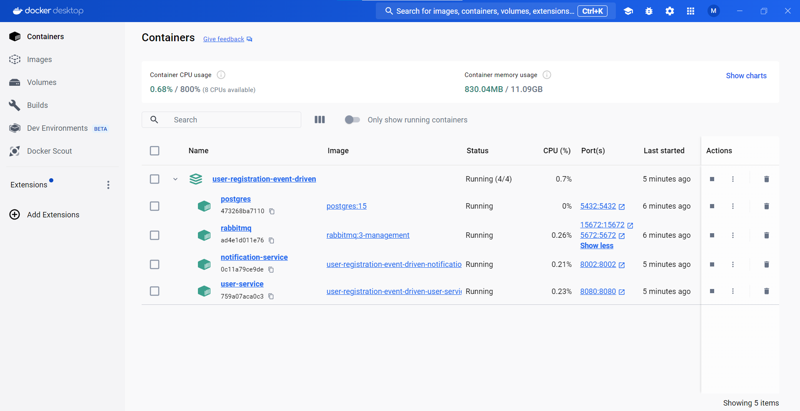
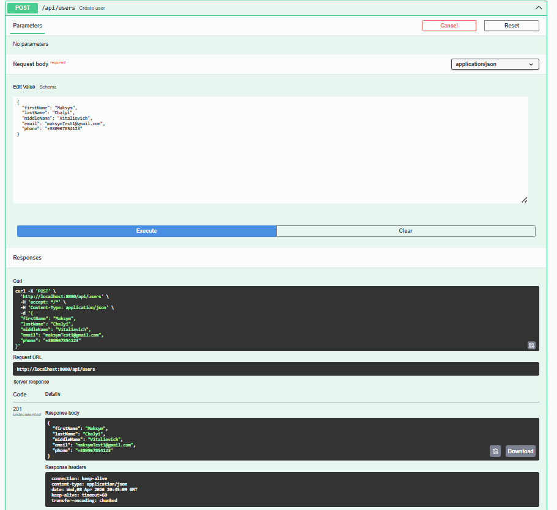
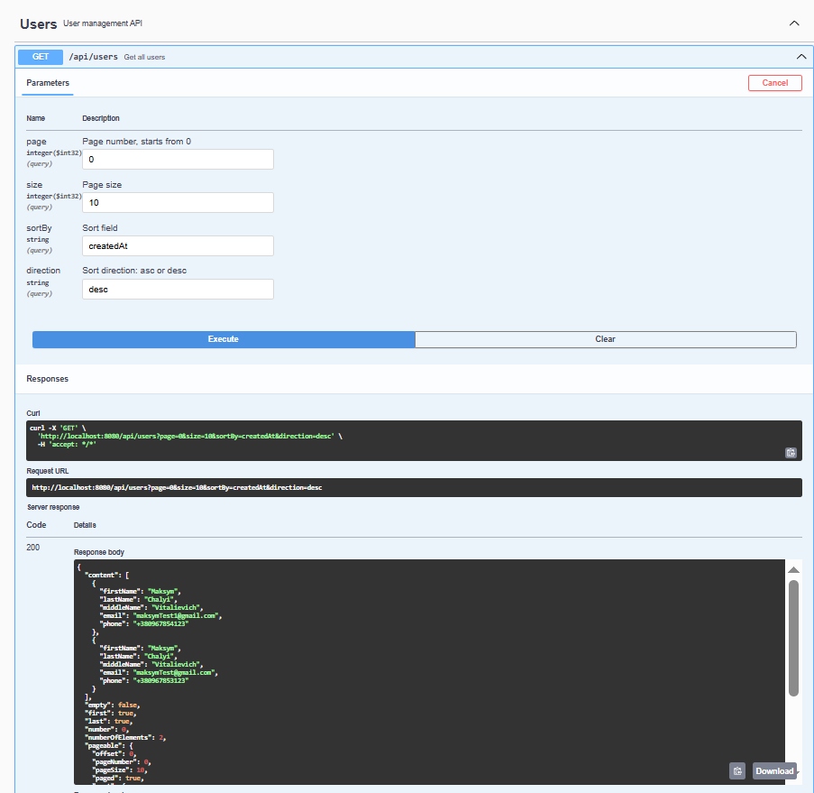
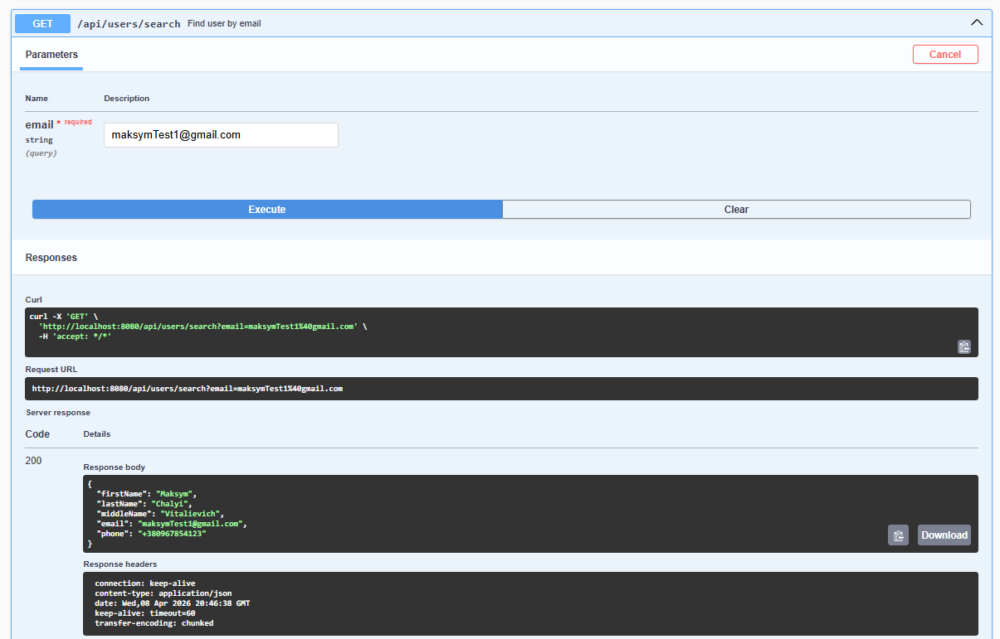

# User Registration Event-Driven System

## Overview

This project is a simple event-driven microservices system.

It consists of two services:

- user-service — creates users and publishes events
- notification-service — consumes events and sends emails

Communication between services is asynchronous via RabbitMQ.

---

## Screenshots

### Docker Containers

### Swagger - Create User

### Swagger - Get All Users

### Swagger - Search User

---

## Tech Stack

- Java 21
- Spring Boot 3
- Spring Data JPA
- PostgreSQL
- RabbitMQ
- Flyway
- Docker, Docker Compose
- OpenAPI (Swagger)

---

## Architecture

Flow:

1. Client sends request to user-service
2. user-service validates and saves user to database
3. user-service publishes UserCreatedEvent to RabbitMQ
4. notification-service consumes the event
5. notification-service sends email

---

## Project Structure

user-registration-event-driven
│
├── user-service
├── notification-service
├── docker-compose.yml
└── pom.xml

---

## Running the Project

### Requirements

- Docker
- Docker Compose

---

### Step 1. Build the project

mvn clean install

---

### Step 2. Start all services

docker-compose up --build

---

### Step 3. Verify services

- user-service: http://localhost:8080
- notification-service: http://localhost:8002
- RabbitMQ UI: http://localhost:15672

RabbitMQ credentials:

- username: guest
- password: guest

---

### Step 4. Test user creation

Open Swagger:

http://localhost:8080/swagger-ui/index.html

Example request:

{
"firstName": "John",
"lastName": "Doe",
"middleName": "A",
"email": "john.doe@example.com",
"phone": "+1234567890"
}

---

## Stopping the Project

docker-compose down -v

---

## Notes

- Email sending is simplified
- No retry or DLQ configured
- No security implemented

---

## Summary

Basic event-driven system with two microservices, asynchronous messaging, and Docker deployment.
